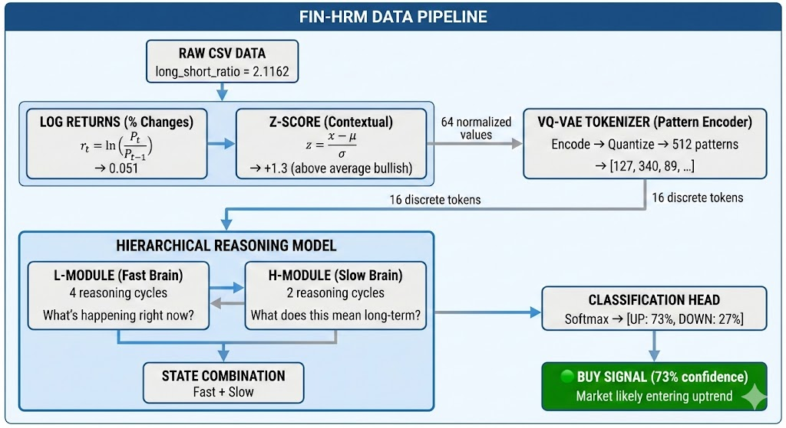

<<<<<<< HEAD
# Herald: Hierarchical Embedding and Reasoning for Adaptive Long-short Trade Detection
=======
# HERALD: Hierarchical Retrieval-Augmented Learning with Discretized features
>>>>>>> d6df1a6 (docs: update project name from Fin-HRM to HERALD)

A hierarchical reasoning architecture adapted for financial time series classification. This implementation combines Vector Quantized Variational Autoencoders (VQ-VAE) for pattern tokenization with a dual-module reasoning system that processes information at different temporal scales.

## Architecture Overview


**Acknowledge**: the figure is created by using Gemini 3 thinking

The system consists of three main components:

### 1. Data Preprocessing Pipeline

Raw financial data undergoes a three-stage transformation:

**Log Returns**: Convert prices to percentage changes using logarithmic returns.
```
r_t = ln(P_t / P_{t-1})
```

**Z-Score Normalization**: Apply rolling window normalization to contextualize each value relative to recent history.
```
z_t = (x_t - μ) / σ
```
A z-score of +1.3 indicates the current value is 1.3 standard deviations above the rolling mean.

**Clipping**: Bound extreme values to [-5, +5] to prevent outliers from destabilizing training.

### 2. VQ-VAE Pattern Tokenizer

The VQ-VAE compresses 64 normalized values into 16 discrete tokens. Each token represents a learned pattern from a codebook of 512 patterns.

Architecture:
- **Encoder**: Two convolutional layers with stride 2 (4x downsampling) followed by residual blocks
- **Vector Quantizer**: Maps continuous encoder outputs to nearest codebook vectors
- **Decoder**: Reconstructs original signal from quantized representations

This tokenization enables the reasoning model to work with discrete pattern sequences rather than raw continuous values.

### 3. Hierarchical Reasoning Model

The core reasoning component consists of two transformer-based modules operating at different temporal frequencies:

**L-MODULE (Low-level / Fast Brain)**
- 4 reasoning cycles per forward pass
- 2 transformer layers
- Processes immediate pattern relationships
- Question: "What is happening right now?"

**H-MODULE (High-level / Slow Brain)**
- 2 reasoning cycles per forward pass
- 2 transformer layers  
- Integrates information across longer horizons
- Question: "What does this mean long-term?"

The modules interact through bidirectional projections:
- L-to-H projection feeds local patterns to the high-level module
- H-to-L projection provides contextual feedback to guide local processing

**State Combination**: Final predictions combine both module states through a learned mixer, then pass through a classification head producing UP/DOWN probabilities.

## Performance Comparison

The following table compares the performance of Fin-HRM (both Standard and LoRA-adapted) against traditional LSTM and Transformer baselines.

| Model | Params | Loss | Accuracy | Precision | Recall | F1 Score | MCC |
| :--- | :--- | :--- | :--- | :--- | :--- | :--- | :--- |
| **Fin-HRM (LoRA)** | **1,272,451** | **0.4111** | **80.45%** | **82.24%** | **80.40%** | **81.31%** | **0.6084** |
| **Fin-HRM (Std)** | 1,186,435 | 0.4886 | 74.89% | 75.40% | 77.95% | 76.66% | 0.4953 |
| **Transformer** | 876,035 | 0.5997 | 66.37% | 64.80% | 79.72% | 71.49% | 0.3256 |
| **LSTM** | 615,171 | 0.6429 | 61.30% | 59.38% | 84.94% | 69.90% | 0.2291 |

## What the Code Does

Given a sequence of financial data (e.g., long/short ratio values), the system:

1. Computes log returns between consecutive values
2. Normalizes returns using a rolling z-score window
3. Encodes 64 timesteps into 16 pattern tokens via VQ-VAE
4. Processes tokens through hierarchical reasoning cycles
5. Outputs probability distribution over UP (bullish) and DOWN (bearish) labels

**Example Flow**:
```
Input: [2.11, 2.08, 2.15, 2.12, ...] (64 ratio values)
  ↓ Log Returns
  [0.0, -0.014, 0.033, -0.014, ...]
  ↓ Z-Score
  [0.0, -1.2, 1.8, -0.9, ...]
  ↓ VQ-VAE Tokenize
  [127, 340, 89, 201, ...] (16 tokens)
  ↓ Hierarchical Reasoning
  L-Module: 4 cycles of local pattern analysis
  H-Module: 2 cycles of trend integration
  ↓ Classification
  Output: [UP: 73%, DOWN: 27%]
```

## Project Structure

```
HERALD/
├── src/
│   ├── data/
│   │   ├── dataset.py        # Dataset classes for VQ-VAE and HRM
│   │   ├── preprocessing.py  # Log returns, z-score, clipping
│   │   └── zigzag.py         # ZigZag trend labeling oracle
│   ├── models/
│   │   ├── vq_vae.py         # Vector Quantized VAE
│   │   ├── working_hrm.py    # Hierarchical Reasoning Model
│   │   ├── hrm.py            # Original HRM architecture
│   │   └── layers.py         # Attention, RoPE, SwiGLU components
│   ├── training/
│   │   ├── trainer.py        # Training loops
│   │   └── optimizer.py      # Optimizer configurations
│   └── utils/
│       └── misc.py           # Seed setting, logging
├── scripts/
│   ├── train_vqvae.py        # VQ-VAE training script
│   └── train_working_hrm.py  # HRM training script
├── dataset/
│   └── long_short_ratio.csv  # Financial data
├── checkpoints_vq/           # VQ-VAE model weights
├── checkpoints_working_hrm/  # HRM model weights
└── requirements.txt
```

## Installation

```bash
python -m venv venv
source venv/bin/activate
pip install -r requirements.txt
```

## Usage

### Train VQ-VAE Tokenizer

```bash
python scripts/train_vqvae.py \
    --data_path dataset/long_short_ratio.csv \
    --target_col long_short_ratio \
    --epochs 20 \
    --batch_size 32
```

### Train Hierarchical Reasoning Model

```bash
python scripts/train_working_hrm.py \
    --data_path dataset/long_short_ratio.csv \
    --target_col long_short_ratio \
    --vqvae_checkpoint checkpoints_vq/vqvae_epoch_20.pt \
    --epochs 50 \
    --batch_size 8 \
    --h_cycles 2 \
    --l_cycles 4 \
    --hidden_size 128
```

## Method Details

### ZigZag Trend Labeling

Ground truth labels are generated using the ZigZag indicator, which identifies significant price reversals. A reversal is confirmed when price moves more than 1% from the last pivot point. This provides binary UP/DOWN labels for each timestep based on whether price is moving toward the next peak or trough.

### Stability Mechanisms

The implementation includes several techniques to ensure stable training:

- **Layer Normalization**: Applied before and after attention in each transformer block
- **Gradient Clipping**: Maximum gradient norm of 0.5, with updates skipped if norm exceeds 5.0
- **State Decay**: Hierarchical states decay by factor of 0.9 between sequences
- **Controlled Updates**: Residual connections scaled by 0.5 and feedback scaled by 0.1
- **Label Smoothing**: 0.1 smoothing on classification targets

### Hierarchical Interaction

The L and H modules exchange information through a coordinated cycle:

```python
for cycle in range(L_cycles):
    # Fast processing
    z_L = L_layers(z_L)
    
    # Periodic slow processing
    if (cycle + 1) % (L_cycles // H_cycles) == 0:
        z_H = H_layers(z_H + project_L_to_H(z_L))
        z_L = z_L + project_H_to_L(z_H)  # Feedback
```

This design allows the H-module to aggregate information across multiple L-module cycles before updating, mimicking the relationship between System 1 (fast, intuitive) and System 2 (slow, deliberate) thinking.

## Requirements

- Python 3.8+
- PyTorch 2.0+
- pandas
- numpy
- tqdm
- einops
- pydantic

## Attribution

- **The Hierarchical Reasoning Model** architecture is adapted from [Sapient Inc.'s HRM implementation](https://github.com/sapientinc/HRM). This project extends the architecture for financial time series applications with VQ-VAE tokenization and domain-specific preprocessing.
- **Financial Data Providers** [@jesusgraterol](http://kaggle.com/datasets/jesusgraterol/bitcoin-open-interest-binance-futures) for market data access
## License

See LICENSE file for details.
